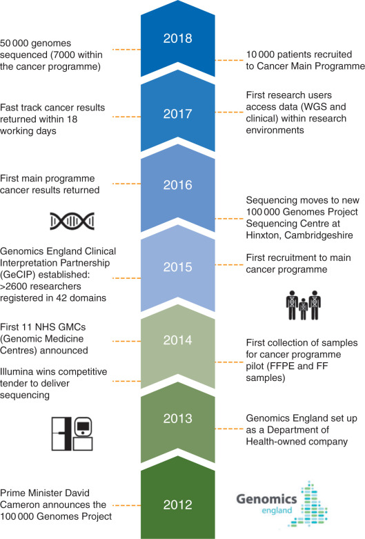

Cancer
+++++++++++++
`Sosinsky A, Ambrose J, Cross W, et al. Insights for precision oncology from the integration of genomic and clinical data of 13,880 tumors from the 100,000 Genomes Cancer Programme[J]. Nature Medicine, 2024: 1-11. <https://www.nature.com/articles/s41591-023-02682-0>`_

`Cancer Analysis Technical Information Document <https://files.genomicsengland.co.uk/forms/Cancer-Analysis-Technical-Information-Document-v1-11-main.pdf>`_

`Mitchell J, Milite S, Bartram J, et al. Clinical application of tumour-in-normal contamination assessment from whole genome sequencing[J]. Nature Communications, 2024, 15(1): 323. <https://www.nature.com/articles/s41467-023-44158-2>`_

Rare-Disease
++++++++++++++++++++++++++
`100,000 Genomes Project Pilot Investigators. 100,000 genomes pilot on rare-disease diagnosis in health care—preliminary report[J]. New England Journal of Medicine, 2021, 385(20): 1868-1880. <https://www.nejm.org/doi/full/10.1056/NEJMoa2035790>`_

`Rare Disease Genome Analysis Guide <https://re-docs.genomicsengland.co.uk/rare_disease_3.pdf>`_

RNAseq
++++++++++++++++++++++++++
`Jaramillo Oquendo C, Wai H A, Rich W, et al. RNA-sequencing first approach generates new diagnostic candidates in Mendelian disorders[J]. medRxiv, 2023: 2023.07. 05.23292254. <https://www.medrxiv.org/content/10.1101/2023.07.05.23292254v2>`_

Covid-19
++++++++++++++++++++++++++
`Kousathanas A, Pairo-Castineira E, Rawlik K, et al. Whole-genome sequencing reveals host factors underlying critical COVID-19[J]. Nature, 2022, 607(7917): 97-103. <https://www.nature.com/articles/s41586-022-04576-6>`_
