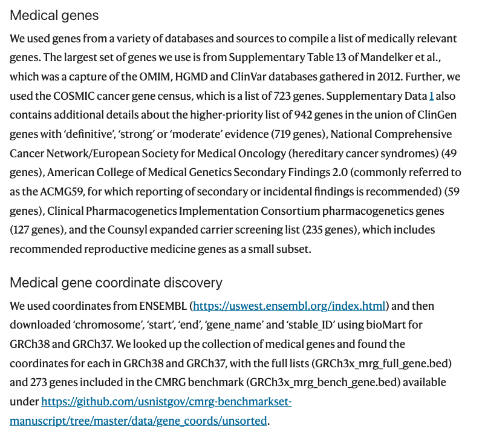

`Scripts used to develop the CMRG benchmark:https://github.com/usnistgov/cmrg-benchmarkset-manuscript <https://github.com/usnistgov/cmrg-benchmarkset-manuscript>`_

`Wagner J, Olson N D, Harris L, et al. Curated variation benchmarks for challenging medically relevant autosomal genes[J]. Nature biotechnology, 2022, 40(5): 672-680. <https://www.nature.com/articles/s41587-021-01158-1>`_

