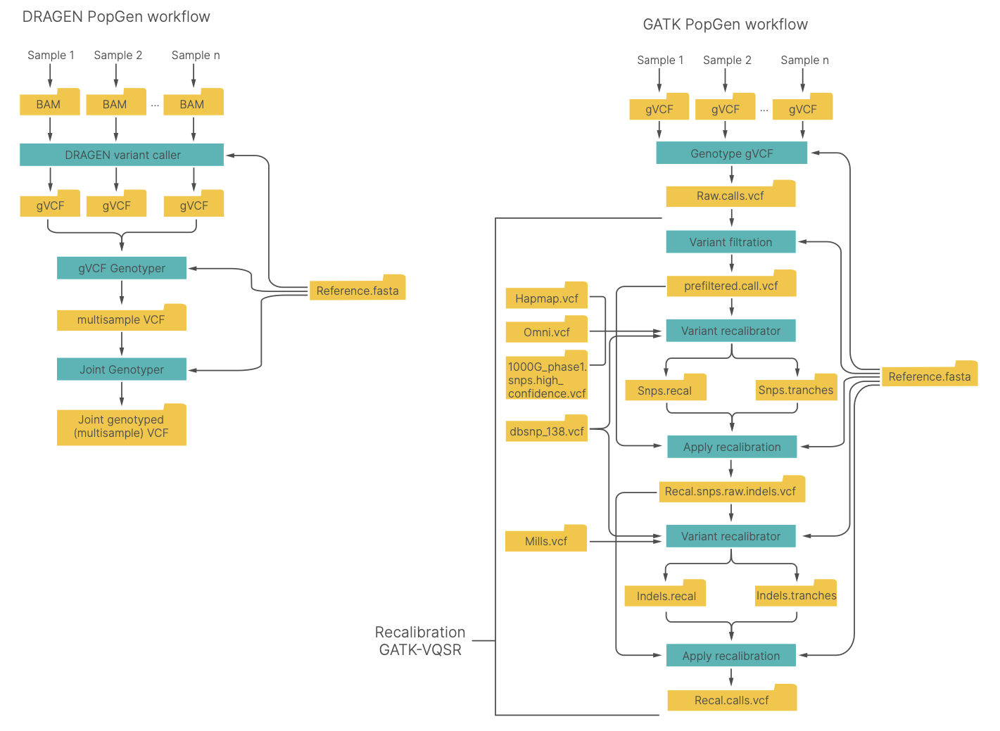
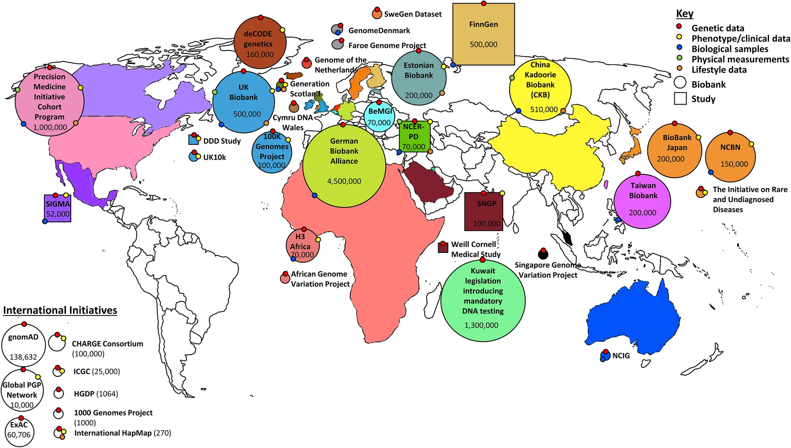
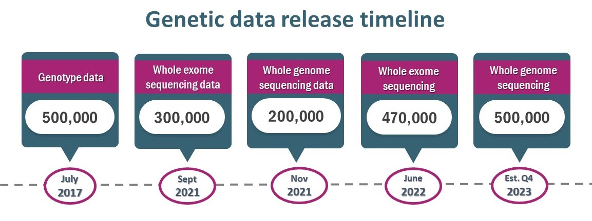
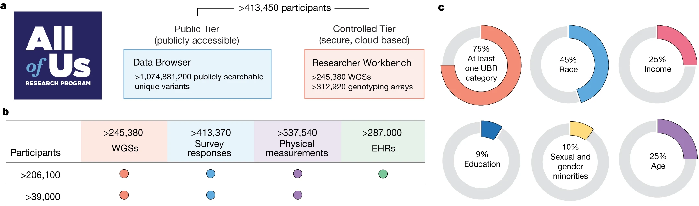
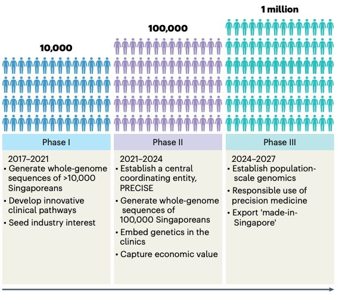
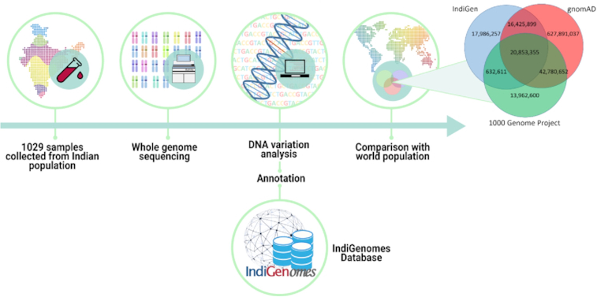
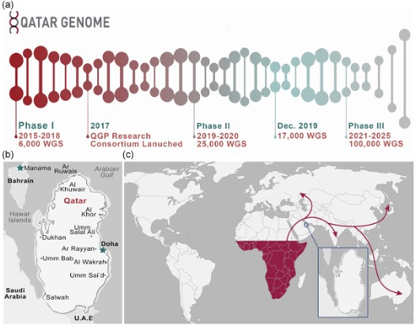
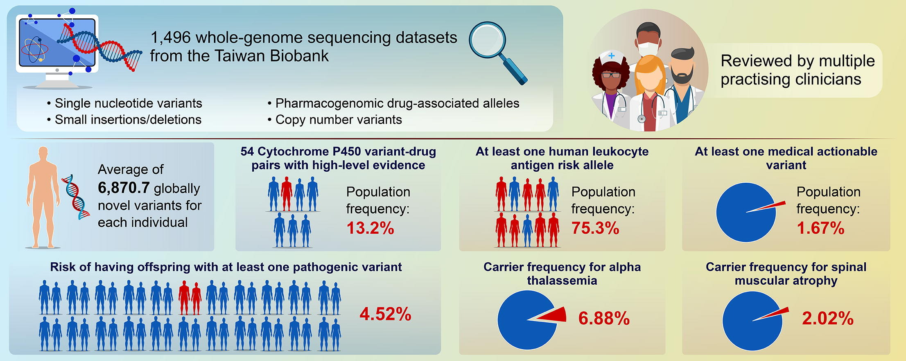

Get started with PopGen
++++++++++++++++++++++++++++++
`Illumina DRAGEN Resources for PopGen:https://developer.illumina.com/dragen/dragen-popgen <https://developer.illumina.com/dragen/dragen-popgen>`_

`Accurate and efficient calling of small and large variants from popgen datasets using the DRAGEN Bio-IT Platform <https://sapac.illumina.com/science/genomics-research/articles/popgen-variant-calling-with-dragen.html>`_

`DRAGEN reanalysis of the 1000 Genomes Dataset now available on the Registry of Open Data <https://aws.amazon.com/cn/blogs/industries/dragen-reanalysis-of-the-1000-genomes-dataset-now-available-on-the-registry-of-open-data/>`_

`UKBB Command Line for DRAGEN <https://developer.illumina.com/dragen/dragen-popgen>`_
::

    dragen -r <hg38-ref-dir> \
    --bam-input <input BAM file> \
    --output-directory <out-dir> \
    --output-file-prefix <prefix> \
    --enable-variant-caller=true \
    --vc-emit-ref-confidence=GVCF \
    --vc-enable-vcf-output=true \
    --enable-duplicate-marking=true \
    --enable-map-align=true \
    --enable-map-align-output=true \
    --output-format=CRAM \
    --vc-hard-filter 'DRAGENHardQUAL:all:QUAL<5.0;LowDepth:all:DP<=1' \
    --vc-frd-max-effective-depth=40 \
    --qc-cross-cont-vcf <path-to>/SNP_NCBI_GRCh38.vcf \
    --qc-coverage-region-1 <path-to>/wgs_coverage_regions.hg38_minus_N.interval_list.bed \
    --qc-coverage-reports-1 cov_report \
    --qc-coverage-region-2 <path-to>/acmg59_allofus_19dec2019.GRC38.wGenes.NEW.bed \
    --qc-coverage-reports-2 cov_report \
    --qc-coverage-ignore-overlaps=true \
    --qc-coverage-count-soft-clipped-bases=true \
    --read-trimmers polyg \
    --soft-read-trimmers none \
    --intermediate-results-dir=/ephemeral/staging/tmp/ \
    --repeat-genotype-enable=true \
    --enable-cyp2d6=true \
    --enable-sv=true \
    --enable-cnv=true \
    --cnv-enable-self-normalization=true \
    --vc-enable-joint-detection=true

**PopGen data processing and analysis workflows using the DRAGEN Platform (left) and GATK best practices (right) workflows**

Global genomic biobanks and studies
########################################################################################################################################

`Carress H, Lawson D J, Elhaik E. Population genetic considerations for using biobanks as international resources in the pandemic era and beyond[J]. BMC genomics, 2021, 22: 1-19. <https://link.springer.com/article/10.1186/s12864-021-07618-x>`_

`Tanjo T, Kawai Y, Tokunaga K, et al. Practical guide for managing large-scale human genome data in research[J]. Journal of Human Genetics, 2021, 66(1): 39-52. <https://www.nature.com/articles/s10038-020-00862-1>`_

UK Biobank:https://www.ukbiobank.ac.uk
########################################################################################################################################

`UK Biobank Allele Frequency Browser：https://afb.ukbiobank.ac.uk/ <https://afb.ukbiobank.ac.uk/>`_

`UK Biobank Whole-Genome Sequencing Consortium, Li S, Carss K J, et al. Whole-genome sequencing of half-a-million UK Biobank participants[J]. medRxiv, 2023: 2023.12. 06.23299426. <https://www.medrxiv.org/content/10.1101/2023.12.06.23299426v1>`_

`Halldorsson B V, Eggertsson H P, Moore K H S, et al. The sequences of 150,119 genomes in the UK Biobank[J]. Nature, 2022, 607(7920): 732-740. <https://www.nature.com/articles/s41586-022-04965-x>`_

Genomics England:https://www.genomicsengland.co.uk/
########################################################################################################################################
**WGS-based genome study of patient with rare disease and their families and cancer patients in England.**

`Cancer_rare-disease_Covid-19 <./Genomics_England/>`_

All of US:https://allofus.nih.gov
########################################################################################################################################

`All of Us Research Program Genomics Investigators. Genomic data in the All of Us Research Program[J]. Nature. <https://www.nature.com/articles/s41586-023-06957-x>`_

`Mahmoud M, Huang Y, Garimella K, et al. Utility of long-read sequencing for All of Us[J]. bioRxiv, 2023: 2023.01. 23.525236. <https://www.biorxiv.org/content/10.1101/2023.01.23.525236v1.abstract>`_

`Lennon N J, Kottyan L C, Kachulis C, et al. Selection, optimization and validation of ten chronic disease polygenic risk scores for clinical implementation in diverse US populations[J]. Nature Medicine, 2024: 1-8. <https://www.nature.com/articles/s41591-024-02796-z#Sec10>`_

PRECISE:https://www.npm.sg
########################################################################################################################################

`SG10K:Wu D, Dou J, Chai X, et al. Large-scale whole-genome sequencing of three diverse Asian populations in Singapore[J]. Cell, 2019, 179(3): 736-749. e15. <https://www.cell.com/cell/pdf/S0092-8674(19)31070-0.pdf>`_

`SG10K_Health:Wong E, Bertin N, Hebrard M, et al. The Singapore National Precision Medicine Strategy[J]. Nature Genetics, 2023, 55(2): 178-186. <https://www.nature.com/articles/s41588-022-01274-x#Sec11>`_

`SG10K_med:Chan S H, Bylstra Y, Teo J X, et al. Analysis of clinically relevant variants from ancestrally diverse Asian genomes[J]. Nature Communications, 2022, 13(1): 6694. <https://www.nature.com/articles/s41467-022-34116-9>`_

`Precision Medicine Research Highlights:https://www.npm.sg/research/research-highlights/ <https://www.npm.sg/research/research-highlights/>`_

`Call for Proposals – Driver Projects for the PRECISE-SG100K Dataset:https://www.npm.sg/research/call-for-proposals/ <https://www.npm.sg/research/call-for-proposals/>`_

`“Call for Proposals” meeting:https://file.for.sg/sg100k-cfp.pdf <https://file.for.sg/sg100k-cfp.pdf>`_

China
########################################################################################################################################
`ChinaMAP:Cao Y, Li L, Xu M, et al. The ChinaMAP analytics of deep whole genome sequences in 10,588 individuals[J]. Cell research, 2020, 30(9): 717-731. <https://www.nature.com/articles/s41422-020-0322-9>`_

`Westlake BioBank:Cong P K, Bai W Y, Li J C, et al. Genomic analyses of 10,376 individuals in the Westlake BioBank for Chinese (WBBC) pilot project[J]. Nature Communications, 2022, 13(1): 2939. <https://www.nature.com/articles/s41467-022-30526-x>`_

`Tian Z, Chen F, Wang J, et al. CAS Array: design and assessment of a genotyping array for Chinese biobanking[J]. Precision Clinical Medicine, 2023, 6(1): pbad002. <https://academic.oup.com/pcm/article/6/1/pbad002/7055961>`_

`Zhang P, Luo H, Li Y, et al. NyuWa Genome resource: a deep whole-genome sequencing-based variation profile and reference panel for the Chinese population[J]. Cell reports, 2021, 37(7). <https://www.cell.com/cell-reports/pdf/S2211-1247(21)01499-6.pdf>`_

IndiGenomes:https://clingen.igib.res.in/indigen/
########################################################################################################################################

`Jain A, Bhoyar R C, Pandhare K, et al. IndiGenomes: a comprehensive resource of genetic variants from over 1000 Indian genomes[J]. Nucleic Acids Research, 2021, 49(D1): D1225-D1232. <https://academic.oup.com/nar/article/49/D1/D1225/5937082?login=true>`_

Qatar genome:https://www.qatargenome.org.qa
########################################################################################################################################

`Mbarek H, Devadoss Gandhi G, Selvaraj S, et al. Qatar genome: Insights on genomics from the Middle East[J]. Human mutation, 2022, 43(4): 499-510. <https://onlinelibrary.wiley.com/doi/full/10.1002/humu.24336>`_

`Qatar Genome Program is about to enter a new era thanks to Illumina #DRAGEN. <https://www.linkedin.com/posts/hamdimbarek_dragen-v4-40k-activity-7154747419908268032-Piej>`_

TaiwanGenomes:https://genomes.tw/#/
########################################################################################################################################

`Hsu J S, Wu D C, Shih S H, et al. Complete genomic profiles of 1,496 Taiwanese reveal curated medical insights[J]. Journal of Advanced Research, 2023. <https://www.sciencedirect.com/science/article/pii/S2090123223004058>`_

1000 Genomes Project:https://www.internationalgenome.org
########################################################################################################################################
**Determining the human genetic variation by means of whole-genome sequencing in population scale.**

`Byrska-Bishop M, Evani U S, Zhao X, et al. High-coverage whole-genome sequencing of the expanded 1000 Genomes Project cohort including 602 trios[J]. Cell, 2022, 185(18): 3426-3440. e19. <https://doi.org/10.1016/j.cell.2022.08.004>`_

`1KG Project reference panel:http://ftp.1000genomes.ebi.ac.uk/vol1/ftp/release/ <http://ftp.1000genomes.ebi.ac.uk/vol1/ftp/release/>`_

GenomeAsia 100K Project:https://genomeasia100k.org/
########################################################################################################################################
**WGS-based genome study of people in South and East Asia.**

`The GenomeAsia 100K Project enables genetic discoveries across Asia[J]. Nature, 2019, 576(7785): 106-111. <https://www.nature.com/articles/s41586-019-1793-z>`_

Mexico City
########################################################################################################################################
`Ziyatdinov A, Torres J, Alegre-Díaz J, et al. Genotyping, sequencing and analysis of 140,000 adults from Mexico City[J]. Nature, 2023, 622(7984): 784-793. <https://www.nature.com/articles/s41586-023-06595-3>`_

FinnGen:https://www.finngen.fi/en
########################################################################################################################################
**Nationwide biobank and genome cohort study in Finland.**

`Kurki M I, Karjalainen J, Palta P, et al. FinnGen provides genetic insights from a well-phenotyped isolated population[J]. Nature, 2023, 613(7944): 508-518. <https://www.nature.com/articles/s41586-022-05473-8#Sec11>`_

Simons genome diversity project
########################################################################################################################################
`Mallick S, Li H, Lipson M, et al. The Simons genome diversity project: 300 genomes from 142 diverse populations[J]. Nature, 2016, 538(7624): 201-206. <https://www.nature.com/articles/nature18964>`_

East Asian populations
########################################################################################################################################
`Choi J, Kim S, Kim J, et al. A whole-genome reference panel of 14,393 individuals for East Asian populations accelerates discovery of rare functional variants[J]. Science Advances, 2023, 9(32): eadg6319. <https://www.science.org/doi/full/10.1126/sciadv.adg6319>`_

Method
########################################################################################################################################
`WES-biobank </WES/>`_
------------------------------------------------------------------------
`Bioinformatics Documents <./bioinformatics/>`_
------------------------------------------------------------------------
`PGx_STR(药物基因组以及短重复序列) <./PGx_STR/>`_
------------------------------------------------------------------------
`Medical_genes(医学临床相关基因) <./Medical_genes/>`_
------------------------------------------------------------------------
`contamination(样本污染) <./contamination/>`_
------------------------------------------------------------------------
`全基因组关联分析(GWAS)与多基因组风险评估polygenic risk scores (PRS) <./GWAS_PRS/>`_
------------------------------------------------------------------------
`pangenome reference(人泛基因组研究) <./pangenome/>`_
------------------------------------------------------------------------
`Imputation(基因型填充) <./Imputation/>`_
------------------------------------------------------------------------
`phasing_genotyping <./phasing_genotyping/>`_
------------------------------------------------------------------------
`The effect of sequencing coverage on structural variation detection sensitivity测序深度 <./coverage_depth/>`_
------------------------------------------------------------------------------------------------------------------------------------------------
