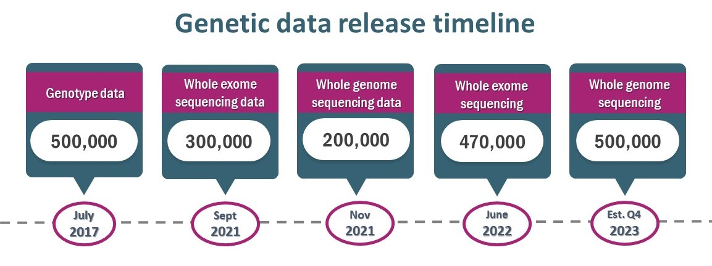
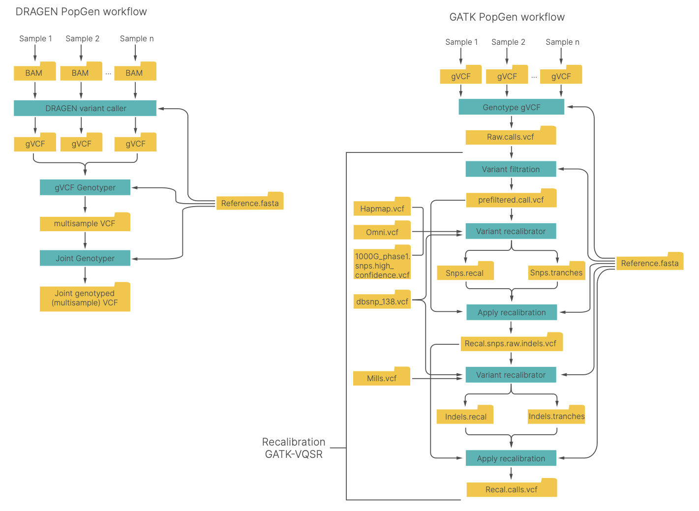

Get started with PopGen
++++++++++++++++++++++++++++++

`Illumina DRAGEN Resources for PopGen:https://developer.illumina.com/dragen/dragen-popgen <https://developer.illumina.com/dragen/dragen-popgen>`_

`Accurate and efficient calling of small and large variants from popgen datasets using the DRAGEN Bio-IT Platform <https://sapac.illumina.com/science/genomics-research/articles/popgen-variant-calling-with-dragen.html>`_

`DRAGEN reanalysis of the 1000 Genomes Dataset now available on the Registry of Open Data <https://aws.amazon.com/cn/blogs/industries/dragen-reanalysis-of-the-1000-genomes-dataset-now-available-on-the-registry-of-open-data/>`_

`biobank主页:https://www.ukbiobank.ac.uk <https://www.ukbiobank.ac.uk>`_

`UKBB Command Line for DRAGEN <https://developer.illumina.com/dragen/dragen-popgen>`_
::

    dragen \
    -r <hg38-ref-dir> \
    --bam-input <input BAM file> \
    --output-directory <out-dir> \
    --output-file-prefix <prefix> \
    --enable-variant-caller=true \
    --vc-emit-ref-confidence=GVCF \
    --vc-enable-vcf-output=true \
    --enable-duplicate-marking=true \
    --enable-map-align=true \
    --enable-map-align-output=true \
    --output-format=CRAM \
    --vc-hard-filter 'DRAGENHardQUAL:all:QUAL<5.0;LowDepth:all:DP<=1' \
    --vc-frd-max-effective-depth=40 \
    --qc-cross-cont-vcf <path-to>/SNP_NCBI_GRCh38.vcf \
    --qc-coverage-region-1 <path-to>/wgs_coverage_regions.hg38_minus_N.interval_list.bed \
    --qc-coverage-reports-1 cov_report \
    --qc-coverage-region-2 <path-to>/acmg59_allofus_19dec2019.GRC38.wGenes.NEW.bed \
    --qc-coverage-reports-2 cov_report \
    --qc-coverage-ignore-overlaps=true \
    --qc-coverage-count-soft-clipped-bases=true \
    --read-trimmers polyg \
    --soft-read-trimmers none \
    --intermediate-results-dir=/ephemeral/staging/tmp/ \
    --repeat-genotype-enable=true \
    --enable-cyp2d6=true \
    --enable-sv=true \
    --enable-cnv=true \
    --cnv-enable-self-normalization=true \
    --vc-enable-joint-detection=true

PopGen data processing and analysis workflows using the DRAGEN Platform (left) and GATK best practices (right) workflows
########################################################################################################################################

`The GenomeAsia 100K Project enables genetic discoveries across Asia[J]. Nature, 2019, 576(7785): 106-111. <https://www.nature.com/articles/s41586-019-1793-z>`_

`Tanjo T, Kawai Y, Tokunaga K, et al. Practical guide for managing large-scale human genome data in research[J]. Journal of Human Genetics, 2021, 66(1): 39-52. <https://www.nature.com/articles/s10038-020-00862-1>`_

`Cong P K, Bai W Y, Li J C, et al. Genomic analyses of 10,376 individuals in the Westlake BioBank for Chinese (WBBC) pilot project[J]. Nature Communications, 2022, 13(1): 2939. <https://www.nature.com/articles/s41467-022-30526-x>`_

`Halldorsson B V, Eggertsson H P, Moore K H S, et al. The sequences of 150,119 genomes in the UK Biobank[J]. Nature, 2022, 607(7920): 732-740. <https://www.nature.com/articles/s41586-022-04965-x>`_

`Byrska-Bishop M, Evani U S, Zhao X, et al. High-coverage whole-genome sequencing of the expanded 1000 Genomes Project cohort including 602 trios[J]. Cell, 2022, 185(18): 3426-3440. e19. <https://doi.org/10.1016/j.cell.2022.08.004>`_

`Jain A, Bhoyar R C, Pandhare K, et al. IndiGenomes: a comprehensive resource of genetic variants from over 1000 Indian genomes[J]. Nucleic Acids Research, 2021, 49(D1): D1225-D1232. <https://academic.oup.com/nar/article/49/D1/D1225/5937082?login=true>`_

.. image:: Overview.png

`Bocher O, Willer C J, Zeggini E. Unravelling the genetic architecture of human complex traits through whole genome sequencing[J]. nature communications, 2023, 14(1): 3520. <https://www.nature.com/articles/s41467-023-39259-x>`_

关于WES
####################################################################

`Van Hout, C. V. et al. Exome sequencing and characterization of 49,960 individuals in the UK Biobank. Nature 586, 749–756 (2020). <https://www.nature.com/articles/s41586-020-2853-0>`_

`Wang Q, Dhindsa R S, Carss K, et al. Rare variant contribution to human disease in 281,104 UK Biobank exomes[J]. Nature, 2021, 597(7877): 527-532. <https://www.nature.com/articles/s41586-021-03855-y>`_

`Kar S P, Quiros P M, Gu M, et al. Genome-wide analyses of 200,453 individuals yield new insights into the causes and consequences of clonal hematopoiesis[J]. Nature Genetics, 2022, 54(8): 1155-1166. <https://www.nature.com/articles/s41588-022-01121-z>`_

`Protocol for Processing UKB Whole Exome Sequencing Data Sets:https://dnanexus.gitbook.io/uk-biobank-rap/science-corner/whole-exome-sequencing-oqfe-protocol/protocol-for-processing-ukb-whole-exome-sequencing-data-sets <https://dnanexus.gitbook.io/uk-biobank-rap/science-corner/whole-exome-sequencing-oqfe-protocol/protocol-for-processing-ukb-whole-exome-sequencing-data-sets>`_

`Original Quality Functional Equivalent (OQFE) Pipeline - Docker Image <https://hub.docker.com/r/dnanexus/oqfe>`_

`Krasheninina O, Hwang Y C, Bai X, et al. Open-source mapping and variant calling for large-scale NGS data from original base-quality scores[J]. bioRxiv, 2020: 2020.12. 15.356360. <https://www.biorxiv.org/content/10.1101/2020.12.15.356360v1>`_

`2022-uk-biobank-exome-release-faq.pdf <https://github.com/fanyucai1/PopGen/blob/main/2022-uk-biobank-exome-release-faq.pdf>`_

`VerifyBamID2 <https://github.com/Griffan/VerifyBamID>`_
######################################################################################################

`Zhang F, Flickinger M, Taliun S A G, et al. Ancestry-agnostic estimation of DNA sample contamination from sequence reads[J]. Genome research, 2020, 30(2): 185-194. <https://genome.cshlp.org/content/30/2/185.short>`_

`graphtyper <https://github.com/DecodeGenetics/graphtyper>`_
####################################################################
::

    graphtyper is a graph-based variant caller capable of genotyping population-scale short read data sets.
    It represents a reference genome and known variants of a genomic region using an acyclic graph structure (a "pangenome reference"), which high-throughput sequence reads are re-aligned to for the purpose of discovering and genotyping SNPs, small indels, and structural variants.

`weCall <https://github.com/Genomicsplc/wecall>`_
####################################################################
::

    weCall is a fast, accurate and simple to use command line tool for variant detection in Next Generation Sequencing (NGS) data.

polygenic risk scores (PRS)
####################################################################

`PRSICE2:https://choishingwan.github.io/PRSice/ <https://choishingwan.github.io/PRSice/>`_

`Collister J A, Liu X, Clifton L. Calculating polygenic risk scores (PRS) in UK Biobank: a practical guide for epidemiologists[J]. Frontiers in genetics, 2022, 13: 818574. <https://www.frontiersin.org/articles/10.3389/fgene.2022.818574/full>`_

`Choi S W, Mak T S H, O’Reilly P F. Tutorial: a guide to performing polygenic risk score analyses[J]. Nature protocols, 2020, 15(9): 2759-2772. <https://www.nature.com/articles/s41596-020-0353-1>`_

pangeome reference
####################################################################

`Gao Y, Yang X, Chen H, et al. A pangenome reference of 36 Chinese populations[J]. Nature, 2023: 1-10. <https://www.nature.com/articles/s41586-023-06173-7>`_

`Liao W W, Asri M, Ebler J, et al. A draft human pangenome reference[J]. Nature, 2023, 617(7960): 312-324. <https://www.nature.com/articles/s41586-023-05896-x>`_

created a reference panel
####################################################################

`Choi J, Kim S, Kim J, et al. A whole-genome reference panel of 14,393 individuals for East Asian populations accelerates discovery of rare functional variants[J]. Science Advances, 2023, 9(32): eadg6319. <https://www.science.org/doi/full/10.1126/sciadv.adg6319>`_

`Tian Z, Chen F, Wang J, et al. CAS Array: design and assessment of a genotyping array for Chinese biobanking[J]. Precision Clinical Medicine, 2023, 6(1): pbad002. <https://academic.oup.com/pcm/article/6/1/pbad002/7055961>`_

`Zhang P, Luo H, Li Y, et al. NyuWa Genome resource: a deep whole-genome sequencing-based variation profile and reference panel for the Chinese population[J]. Cell reports, 2021, 37(7). <https://www.cell.com/cell-reports/pdf/S2211-1247(21)01499-6.pdf>`_

`Li Y, DeVito R, Mousavi N, et al. A deep population reference panel of tandem repeat variation[J]. Nature Communications, 2023, 14(1): 6711-6711. <https://www.nature.com/articles/s41467-023-42278-3>`_

STR
####################################################################

`Shi Y, Niu Y, Zhang P, et al. Characterization of genome-wide STR variation in 6487 human genomes[J]. Nature Communications, 2023, 14(1): 2092. <https://www.nature.com/articles/s41467-023-37690-8>`_

`Li Y, DeVito R, Mousavi N, et al. A deep population reference panel of tandem repeat variation[J]. Nature Communications, 2023, 14(1): 6711-6711. <https://www.nature.com/articles/s41467-023-42278-3>`_

专病队列
####################################################################

`Taliun D, Harris D N, Kessler M D, et al. Sequencing of 53,831 diverse genomes from the NHLBI TOPMed Program[J]. Nature, 2021, 590(7845): 290-299. <https://www.nature.com/articles/s41586-021-03205-y>`_

pharmacogenomics (PGx) analysis
####################################################################

`Venner E, Muzny D, Smith J D, et al. Whole-genome sequencing as an investigational device for return of hereditary disease risk and pharmacogenomic results as part of the All of Us Research Program[J]. Genome Medicine, 2022, 14(1): 34. <https://link.springer.com/article/10.1186/s13073-022-01031-z>`_
