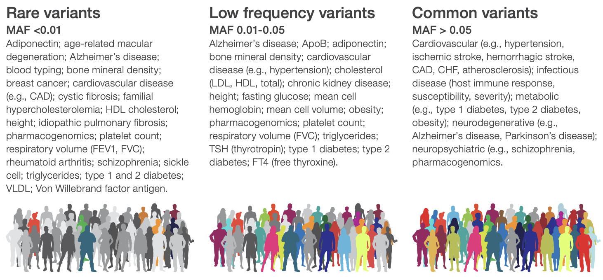
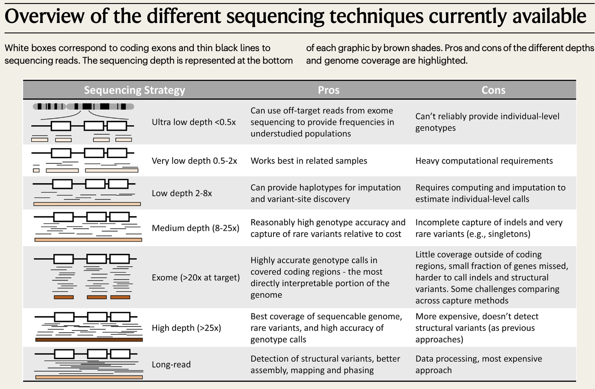
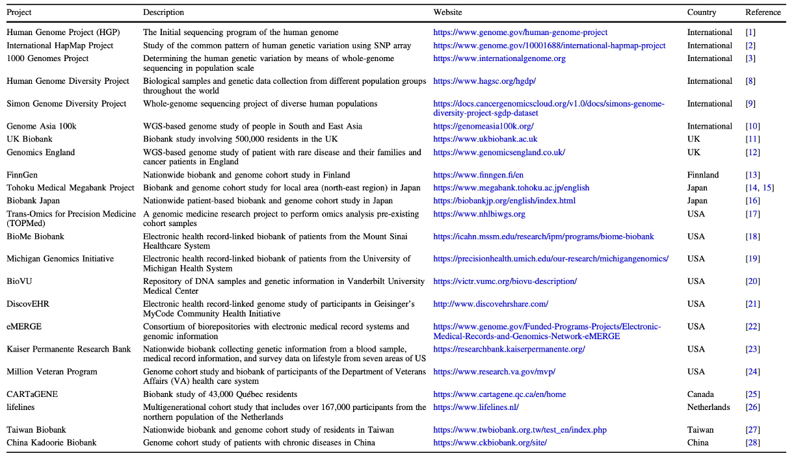
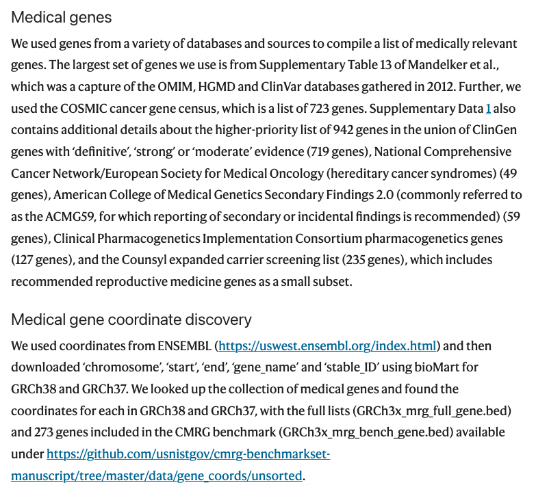
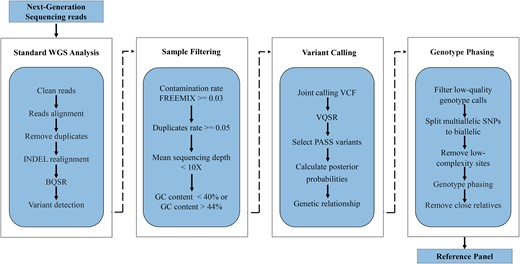
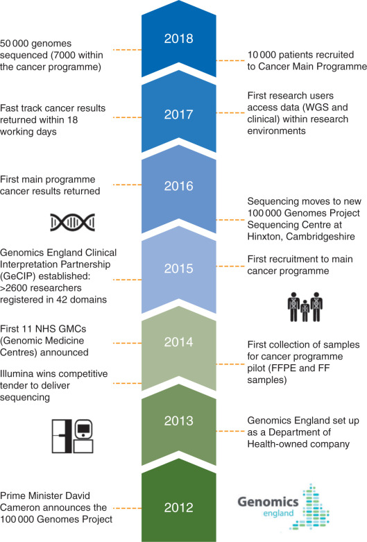
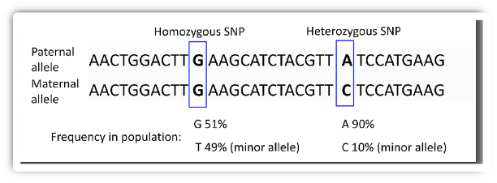

Get started with PopGen
++++++++++++++++++++++++++++++
`Illumina DRAGEN Resources for PopGen:https://developer.illumina.com/dragen/dragen-popgen <https://developer.illumina.com/dragen/dragen-popgen>`_

`Accurate and efficient calling of small and large variants from popgen datasets using the DRAGEN Bio-IT Platform <https://sapac.illumina.com/science/genomics-research/articles/popgen-variant-calling-with-dragen.html>`_

`DRAGEN reanalysis of the 1000 Genomes Dataset now available on the Registry of Open Data <https://aws.amazon.com/cn/blogs/industries/dragen-reanalysis-of-the-1000-genomes-dataset-now-available-on-the-registry-of-open-data/>`_

`biobank主页:https://www.ukbiobank.ac.uk <https://www.ukbiobank.ac.uk>`_

.. image:: png/genetic-data-sept2022.jpg

`UKBB Command Line for DRAGEN <https://developer.illumina.com/dragen/dragen-popgen>`_
::

    dragen -r <hg38-ref-dir> \
    --bam-input <input BAM file> \
    --output-directory <out-dir> \
    --output-file-prefix <prefix> \
    --enable-variant-caller=true \
    --vc-emit-ref-confidence=GVCF \
    --vc-enable-vcf-output=true \
    --enable-duplicate-marking=true \
    --enable-map-align=true \
    --enable-map-align-output=true \
    --output-format=CRAM \
    --vc-hard-filter 'DRAGENHardQUAL:all:QUAL<5.0;LowDepth:all:DP<=1' \
    --vc-frd-max-effective-depth=40 \
    --qc-cross-cont-vcf <path-to>/SNP_NCBI_GRCh38.vcf \
    --qc-coverage-region-1 <path-to>/wgs_coverage_regions.hg38_minus_N.interval_list.bed \
    --qc-coverage-reports-1 cov_report \
    --qc-coverage-region-2 <path-to>/acmg59_allofus_19dec2019.GRC38.wGenes.NEW.bed \
    --qc-coverage-reports-2 cov_report \
    --qc-coverage-ignore-overlaps=true \
    --qc-coverage-count-soft-clipped-bases=true \
    --read-trimmers polyg \
    --soft-read-trimmers none \
    --intermediate-results-dir=/ephemeral/staging/tmp/ \
    --repeat-genotype-enable=true \
    --enable-cyp2d6=true \
    --enable-sv=true \
    --enable-cnv=true \
    --cnv-enable-self-normalization=true \
    --vc-enable-joint-detection=true

PopGen data processing and analysis workflows using the DRAGEN Platform (left) and GATK best practices (right) workflows
########################################################################################################################################

.. image:: png/dragen-popgen.png

Practical guide
########################################################################################################################################

`Navigating the technology landscape for population-scale predictive genomics <https://assets.thermofisher.com/TFS-Assets/GSD/Reference-Materials/Whitepaper-Technology-Predictive-Genomics.pdf>`_

`Bocher O, Willer C J, Zeggini E. Unravelling the genetic architecture of human complex traits through whole genome sequencing[J]. nature communications, 2023, 14(1): 3520. <https://www.nature.com/articles/s41467-023-39259-x>`_

`Nagasaki M, Sekiya Y, Asakura A, et al. Design and implementation of a hybrid cloud system for large-scale human genomic research[J]. Human Genome Variation, 2023, 10(1): 6. <https://www.nature.com/articles/s41439-023-00231-2>`_

`Tanjo T, Kawai Y, Tokunaga K, et al. Practical guide for managing large-scale human genome data in research[J]. Journal of Human Genetics, 2021, 66(1): 39-52. <https://www.nature.com/articles/s10038-020-00862-1>`_

`Biobank </Biobank/>`_
########################################################################################################################################
`关于WES <WES/>`_
####################################################################

Medical_genes
####################################################################
`Scripts used to develop the CMRG benchmark:https://github.com/usnistgov/cmrg-benchmarkset-manuscript <https://github.com/usnistgov/cmrg-benchmarkset-manuscript>`_

`Wagner J, Olson N D, Harris L, et al. Curated variation benchmarks for challenging medically relevant autosomal genes[J]. Nature biotechnology, 2022, 40(5): 672-680. <https://www.nature.com/articles/s41587-021-01158-1>`_

contamination
######################################################################################################
`VerifyBamID2:https://github.com/Griffan/VerifyBamID <https://github.com/Griffan/VerifyBamID>`_

`Zhang F, Flickinger M, Taliun S A G, et al. Ancestry-agnostic estimation of DNA sample contamination from sequence reads[J]. Genome research, 2020, 30(2): 185-194. <https://genome.cshlp.org/content/30/2/185.short>`_

`read_haps:https://github.com/DecodeGenetics/read_haps <https://github.com/DecodeGenetics/read_haps>`_

`Eggertsson H P, Halldorsson B V. read_haps: using read haplotypes to detect same species contamination in DNA sequences[J]. Bioinformatics, 2021, 37(15): 2215-2217. <https://academic.oup.com/bioinformatics/article/37/15/2215/5948993>`_

genotyping
####################################################################
`graphtyper <https://github.com/DecodeGenetics/graphtyper>`_

`Eggertsson H P, Jonsson H, Kristmundsdottir S, et al. Graphtyper enables population-scale genotyping using pangenome graphs[J]. Nature genetics, 2017, 49(11): 1654-1660. <https://www.nature.com/articles/ng.3964>`_

`Eggertsson H P, Kristmundsdottir S, Beyter D, et al. GraphTyper2 enables population-scale genotyping of structural variation using pangenome graphs[J]. Nature communications, 2019, 10(1): 5402. <https://www.nature.com/articles/s41467-019-13341-9>`_

`GWAS(Association analyses)+polygenic risk scores (PRS) <./GWAS_PRS/>`_
####################################################################

pangenome reference
####################################################################
`Deng L, Xie B, Wang Y, et al. A protocol for applying a population-specific reference genome assembly to population genetics and medical studies[J]. STAR protocols, 2022, 3(2): 101440. <https://www.sciencedirect.com/science/article/pii/S2666166722003203>`_

`Gao Y, Yang X, Chen H, et al. A pangenome reference of 36 Chinese populations[J]. Nature, 2023: 1-10. <https://www.nature.com/articles/s41586-023-06173-7>`_

`Liao W W, Asri M, Ebler J, et al. A draft human pangenome reference[J]. Nature, 2023, 617(7960): 312-324. <https://www.nature.com/articles/s41586-023-05896-x>`_

created a reference panel
####################################################################
`Choi J, Kim S, Kim J, et al. A whole-genome reference panel of 14,393 individuals for East Asian populations accelerates discovery of rare functional variants[J]. Science Advances, 2023, 9(32): eadg6319. <https://www.science.org/doi/full/10.1126/sciadv.adg6319>`_

`Tian Z, Chen F, Wang J, et al. CAS Array: design and assessment of a genotyping array for Chinese biobanking[J]. Precision Clinical Medicine, 2023, 6(1): pbad002. <https://academic.oup.com/pcm/article/6/1/pbad002/7055961>`_

`Zhang P, Luo H, Li Y, et al. NyuWa Genome resource: a deep whole-genome sequencing-based variation profile and reference panel for the Chinese population[J]. Cell reports, 2021, 37(7). <https://www.cell.com/cell-reports/pdf/S2211-1247(21)01499-6.pdf>`_

`Li Y, DeVito R, Mousavi N, et al. A deep population reference panel of tandem repeat variation[J]. Nature Communications, 2023, 14(1): 6711-6711. <https://www.nature.com/articles/s41467-023-42278-3>`_

`1KG Project reference panel:http://ftp.1000genomes.ebi.ac.uk/vol1/ftp/release/ <http://ftp.1000genomes.ebi.ac.uk/vol1/ftp/release/>`_

`Shi S, Rubinacci S, Hu S, et al. A Genomics England haplotype reference panel and the imputation of the UK Biobank[J]. medRxiv, 2023: 2023.11. 06.23298035. <https://www.medrxiv.org/content/10.1101/2023.11.06.23298035v1>`_

Imputation
####################################################################
`GLIMPSE2 is a set of tools for low-coverage whole genome sequencing imputation.  <https://odelaneau.github.io/GLIMPSE/>`_

`Rubinacci S, Hofmeister R J, Sousa da Mota B, et al. Imputation of low-coverage sequencing data from 150,119 UK Biobank genomes[J]. Nature Genetics, 2023, 55(7): 1088-1090. <https://www.nature.com/articles/s41588-023-01438-3>`_

phasing
####################################################################
**common variant phasing** (MAF >=0.1%) and **rare variants** (MAF<0.1%)

**Singleton phasing(singleton variants (minor allele count (MAC) of 1))**

This is a well-known limitation of all statistical phasing methods. SHAPEIT5 can provide inference at these sites by using the Viterbi algorithm for the Li and Stephens model, to obtain the longest shared IBD segment between each one of the two target haplotypes and the conditioning haplotypes.

`SHAPEIT5: https://odelaneau.github.io/shapeit5/ <https://odelaneau.github.io/shapeit5/>`_

`Hofmeister R J, Ribeiro D M, Rubinacci S, et al. Accurate rare variant phasing of whole-genome and whole-exome sequencing data in the UK Biobank[J]. Nature Genetics, 2023, 55(7): 1243-1249. <https://www.nature.com/articles/s41588-023-01415-w>`_

The pipeline uses **BCFtools** for marker filtering, **Beagle** for genotype phasing, and Tabix for VCF indexing.The pipeline’s QC filter excludes markers with AAScore <=0.95, markers with >=5% missing data, and non-SNV markers.

`ukb-phasing:https://github.com/browning-lab/ukb-phasing/ <https://github.com/browning-lab/ukb-phasing/>`_

`Browning B L, Browning S R. Statistical phasing of 150,119 sequenced genomes in the UK Biobank[J]. The American Journal of Human Genetics, 2023, 110(1): 161-165. <https://www.cell.com/ajhg/pdf/S0002-9297(22)00499-2.pdf>`_

`PGx_STR <./PGx_STR/>`_
####################################################################

rare disease and cancer
####################################################################
`Taliun D, Harris D N, Kessler M D, et al. Sequencing of 53,831 diverse genomes from the NHLBI TOPMed Program[J]. Nature, 2021, 590(7845): 290-299. <https://www.nature.com/articles/s41586-021-03205-y>`_

`Yu C, Lan X, Tao Y, et al. A high-resolution haplotype-resolved Reference panel constructed from the China Kadoorie Biobank Study[J]. Nucleic Acids Research, 2023, 51(21): 11770-11782. <https://academic.oup.com/nar/article/51/21/11770/7327062>`_

WGS [of paired DNA, tumour (∼80×) and germline (∼40×)] is delivered by Illumina at the new national 100 000 Genomes Sequencing Centre in Hinxton, Cambridgeshire. Processed sequencing files (BAMs, FASTQs) are then passed back to Genomics England.

`Turnbull C. Introducing whole-genome sequencing into routine cancer care: the Genomics England 100 000 Genomes Project[J]. Annals of Oncology, 2018, 29(4): 784-787. <https://www.annalsofoncology.org/article/S0923-7534(19)45492-6/fulltext>`_

Sequencing was performed to a mean coverage of approximately 100X in the tumour and 40X in the paired normal sample.

`Trotman J, Armstrong R, Firth H, et al. The NHS England 100,000 Genomes Project: feasibility and utility of centralised genome sequencing for children with cancer[J]. British Journal of Cancer, 2022, 127(1): 137-144. <https://www.nature.com/articles/s41416-022-01788-5>`_

**Genomics England文章**

`Sosinsky A, Ambrose J, Cross W, et al. Insights for precision oncology from the integration of genomic and clinical data of 13,880 tumors from the 100,000 Genomes Cancer Programme[J]. Nature Medicine, 2024: 1-11. <https://www.nature.com/articles/s41591-023-02682-0>`_

The effect of sequencing coverage on structural variation (SNV+CNV+SV) detection sensitivity
###########################################################################################################

*almost all homozygous SNVs are detected at a 15× average depth, an average depth of 33× is required to detect the same proportion of heterozygous SNVs*

`Sims D, Sudbery I, Ilott N E, et al. Sequencing depth and coverage: key considerations in genomic analyses[J]. Nature Reviews Genetics, 2014, 15(2): 121-132. <https://www.nature.com/articles/nrg3642>`_

================================  ================================  ================================
SNV                                 CNV                                 SV
================================  ================================  ================================
.. image:: png/snp.png                 .. image:: png/CNV.png                  .. image:: png/SV.png
================================  ================================  ================================

`Yang L. A practical guide for structural variation detection in the human genome[J]. Current protocols in human genetics, 2020, 107(1): e103. <https://doi.org/10.1002/cphg.103>`_

`Meynert A M, Ansari M, FitzPatrick D R, et al. Variant detection sensitivity and biases in whole genome and exome sequencing[J]. BMC bioinformatics, 2014, 15: 1-11. <https://link.springer.com/article/10.1186/1471-2105-15-247>`_

`Kucharík M, Budiš J, Hýblová M, et al. Copy number variant detection with low-coverage whole-genome sequencing represents a viable alternative to the conventional array-CGH[J]. Diagnostics, 2021, 11(4): 708. <https://www.mdpi.com/2075-4418/11/4/708>`_

long-read sequencing for All of Us
####################################################################
`Mahmoud M, Huang Y, Garimella K, et al. Utility of long-read sequencing for All of Us[J]. bioRxiv, 2023: 2023.01. 23.525236. <https://www.biorxiv.org/content/10.1101/2023.01.23.525236v1.abstract>`_

`bioinformatics <./bioinformatics/>`_
#####################################################################

Link
#######################
`UK Biobank Allele Frequency Browser <https://afb.ukbiobank.ac.uk/>`_
