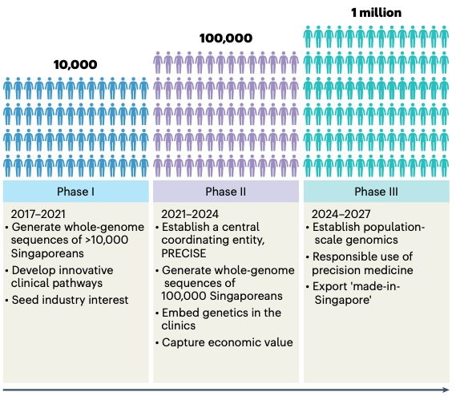

1.  `Westlake BioBank for Chinese pilot project:https://github.com/peikuan/WBBC <https://github.com/peikuan/WBBC>`_

2.  `All of Us Research Program:https://github.com/all-of-us <https://github.com/all-of-us>`_

3.  `UK Biobank:https://github.com/UK-Biobank <https://github.com/UK-Biobank>`_

4.  `UKBseq500k-methods:https://github.com/UKBseq500k-methods <https://github.com/UKBseq500k-methods>`_

5.  `SG10K_Med:https://github.com/csockhoai/SG10KMed <https://github.com/csockhoai/SG10KMed>`_

6.  `SG10K_Health:https://github.com/c-BIG/sg10k-health/tree/main <https://github.com/c-BIG/sg10k-health/tree/main>`_

7.  `Rare_Disease_Genome_Analysis_Guide.pdf <https://re-docs.genomicsengland.co.uk/rare_disease_3.pdf>`_

8.  `Reference GRCh38:https://ftp.ncbi.nlm.nih.gov/1000genomes/ftp/technical/reference/GRCh38_reference_genome/ <https://ftp.ncbi.nlm.nih.gov/1000genomes/ftp/technical/reference/GRCh38_reference_genome/>`_

9.  `Genomics England Research Environment User Guide:https://re-docs.genomicsengland.co.uk/data_overview/ <https://re-docs.genomicsengland.co.uk/data_overview/>`_
