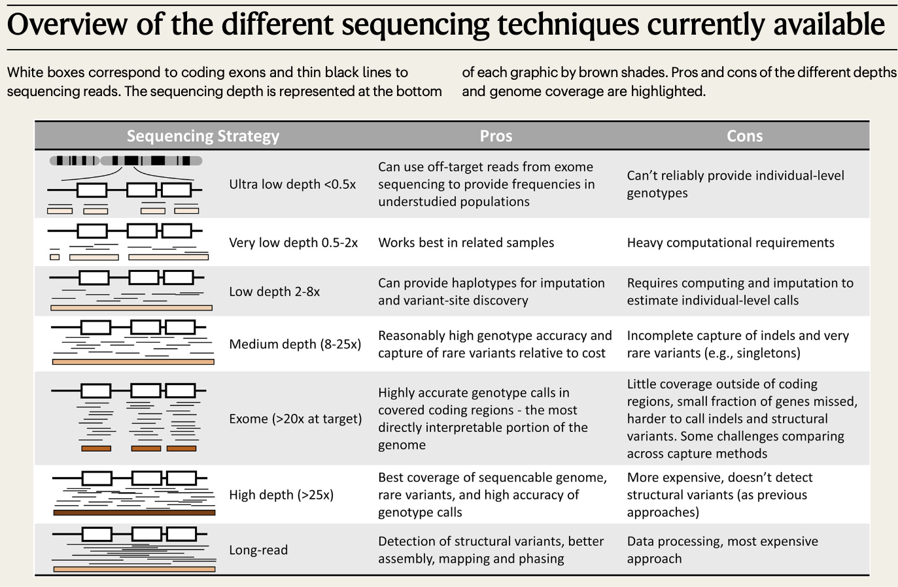
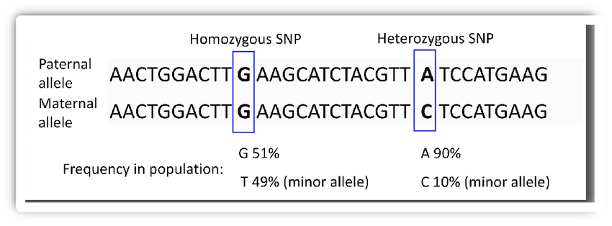

Overview of the different sequencing techniques currently available
########################################################################################################################################

*almost all homozygous SNVs are detected at a 15× average depth, an average depth of 33× is required to detect the same proportion of heterozygous SNVs*

`Sims D, Sudbery I, Ilott N E, et al. Sequencing depth and coverage: key considerations in genomic analyses[J]. Nature Reviews Genetics, 2014, 15(2): 121-132. <https://www.nature.com/articles/nrg3642>`_

================================  ================================  ================================
SNV                                 CNV                                 SV
================================  ================================  ================================
.. image:: ./SNV.png                 .. image:: ./CNV.png                  .. image:: ./SV.png
================================  ================================  ================================

`Yang L. A practical guide for structural variation detection in the human genome[J]. Current protocols in human genetics, 2020, 107(1): e103. <https://doi.org/10.1002/cphg.103>`_

`Meynert A M, Ansari M, FitzPatrick D R, et al. Variant detection sensitivity and biases in whole genome and exome sequencing[J]. BMC bioinformatics, 2014, 15: 1-11. <https://link.springer.com/article/10.1186/1471-2105-15-247>`_

`Kucharík M, Budiš J, Hýblová M, et al. Copy number variant detection with low-coverage whole-genome sequencing represents a viable alternative to the conventional array-CGH[J]. Diagnostics, 2021, 11(4): 708. <https://www.mdpi.com/2075-4418/11/4/708>`_
